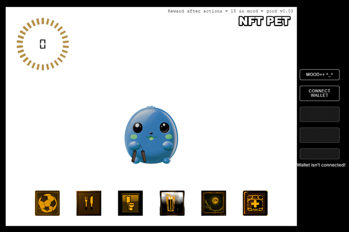
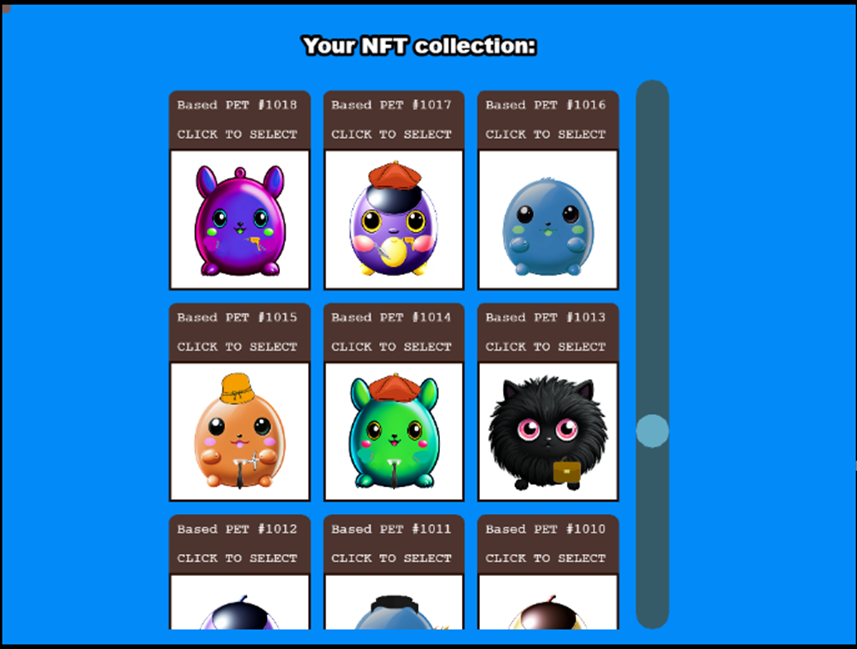

https://github.com/profffff/nftpetapp

# NFTPET App

Demo: https://nftpet.netlify.app/

It's a small personal project-game where the main goal is to raise a pet (aka Tamagotchi), with the reward being the opportunity to mint an NFT. The token can be used as a character in the game.



A self-made collection of NFTs, strikingly reminiscent of Pokémons.



## How to play
To get a reward (NFT), you need to poke 15 times on the correct buttons and the pet's mood should be good (8) or better. Incorrect actions lead to a decrease in mood.  
Stages:   
0 dead  
1-2 angry   
3-4 sad   
5-6 neutral  
7-8 good  
9-10 happy  
P.S. The supply of NFTs available is limited to 1500, and may run out. Have fun!

## Running Locally
Clone project locally

Create **.env.local** file in the root directory (check .env.example to see what needs to be included)

Install dependencies:

```bash
npm install
```

Run the development server:

```bash
npm run dev
```

Open [http://localhost:3000](http://localhost:3000) with your browser to see the result.

## Stack
- Programming language: TypeScript
- Frontend framework: React.js
- Framework for server-rendered React applications: Next.js
- Game development framework: Phaser
- Smart-contract: Thirdweb
- Blockchain interaction framework: Wagmi
- TS interface for Eutherium: Viem
- HTTP client: Axios

## Project Structure
- `components` - Contains the React components.
- `src` - Contains the game source code and app entry points.
- `src/app/page.tsx` - The main Next.js component.
- `src/app/App.tsx` - Midleware component used to run Phaser in client mode.
- `src/game/PhaserGame.tsx` - The React component that initializes the Phaser Game and serve like a bridge between React and Phaser.
- `src/game/main.tsx` - The main **game** entry point. This contains the game configuration and start the game.
- `src/values/constants/gameConstants.ts` - Game settings
- `public/assets` - Contains the static assets used by the game.

### Blockchain
Amoy Testnet for Polygon PoS

### DevTools 
Google Lighthouse Score: 77

### Bugs (to do)
src.IndexOf error after minting the NFT   
happy animation glitch along the Y-axis  
disfunction of the scene manager due to init() in the main scene  
css libraries are not used properly (just unnecessary dependencies)

## Useful links
- Inspired by [Sitting Cats](https://github.com/danilo-89/sitting-cats-nft/tree/main)
- [Cool NFT configurator](https://github.com/Jon-Becker/nft-generator-py)
- [Free Polygon Testnet MATIC](https://www.alchemy.com/faucets/polygon-amoy)
- [Phaser Next.js Template](https://github.com/phaserjs/template-nextjs)

## Contact
Feel free to get in touch  
[Nik](https://www.reddit.com/user/parrof/)

